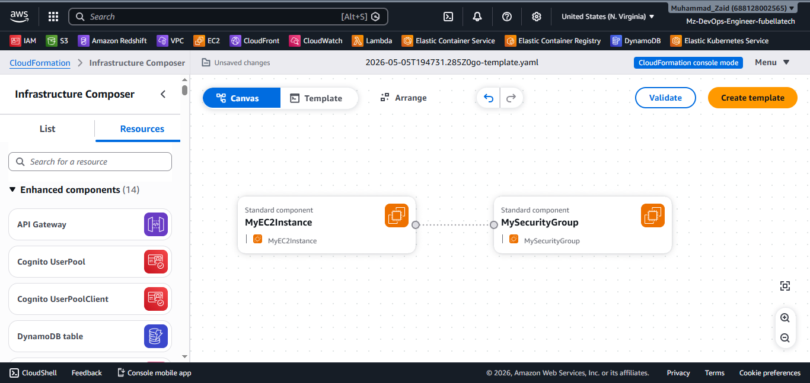
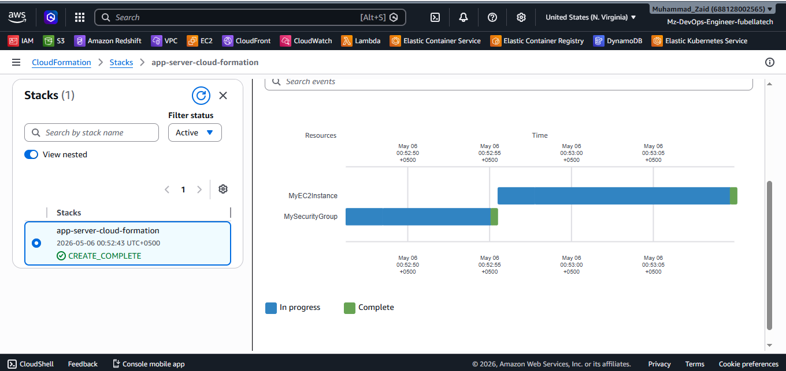

# 🚀 Deploy a Dockerized Web App using CloudFormation

This project demonstrates how to deploy a Dockerized Node.js application on AWS using CloudFormation.

---

## 🧱 Architecture

User → EC2 Instance → Docker Container

---

## 🔧 Technologies Used

- AWS CloudFormation (Infrastructure as Code)
- EC2 (Compute)
- Docker
- Amazon S3
- Security Groups

---

## 🚀 Features

- Infrastructure fully automated using CloudFormation
- Docker container deployed on EC2 using UserData
- Security Group configuration for SSH and application access
- S3 bucket created for storage

---

## 📂 Project Structure

.
├── template.yaml
├── README.md

---

## ⚙️ Deployment Steps

1. Clone the repository
2. Configure AWS CLI
3. Run:

## ⚙️ 🌐 Access Application

After deployment, open:

http://EC2-PUBLIC-IP:3000

## 📸 Screenshots

